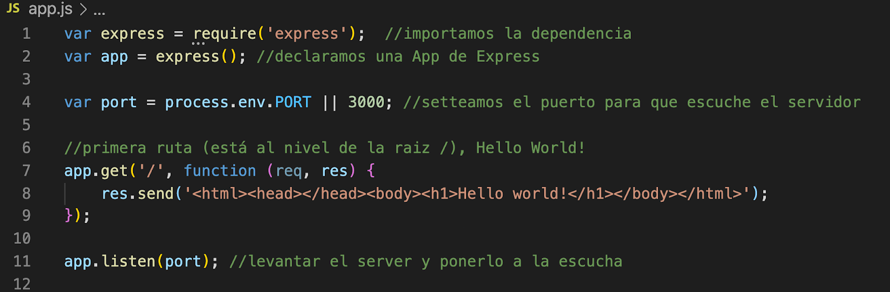

# Practica #10: Ruteo
El  siguiente ejercicio tiene como objetivo mostrar la forma en la que podemos establecer más de una ruta para nuestra App de Express, y la forma en la que podemos recuperar información contenida en la colección “params” del objeto “request”.

## Instrucciones
- En tu directorio de trabajo crea el directorio practica_10
- Cambiate al directorio “practica_10” e inicializa NPM (npm init -y)
- Instala el paquete “express” desde la línea de comando
- Instala el paquete “nodemon” desde la línea de comando de forma global (bandera -g) 
- Crea un nuevo archivo que se llame index.js
- Escribe el código que se muestra a continuación:

