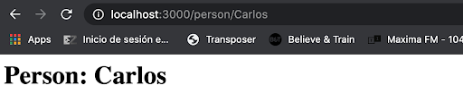

# Practica #10: Ruteo
El  siguiente ejercicio tiene como objetivo mostrar la forma en la que podemos establecer más de una ruta para nuestra App de Express, y la forma en la que podemos recuperar información contenida en la colección “params” del objeto “request”.

## Instrucciones
- En tu directorio de trabajo crea el directorio practica_10
- Cambiate al directorio “practica_10” e inicializa NPM (npm init -y)
- Instala el paquete “express” desde la línea de comando
- Instala el paquete “nodemon” desde la línea de comando de forma global (bandera -g) 
- Crea un nuevo archivo que se llame index.js
- Escribe el código que se muestra a continuación:

- Salva los cambios, y desde la línea de comando escribe “npx nodemon” 
- Abre una nueva ventana de tu web browser y accede al URL localhost:3000, debes tener un mensaje de la forma “Hello world”.
- Ahora agregaremos una segunda ruta, la cual regresa un objeto JSON, simulando que es la respuesta de una API, agrega el siguiente código en la línea 10 y salva los cambios:

- Debido a que el servidor está “levantado” con “nodemon”, los cambios se reflejan automáticamente, así que regresa a tu navegador y accede a  localhost:3000/api, debe mostrarse lo siguiente:

- Nota: En mi caso, mi navegador tiene instalado un plugin para formatear JSON, si el tuyo no lo tiene, mostrará la información en formato “raw”.

formato “raw”

- Ahora agregaremos una tercera ruta, mediante la cual, podemos enviar un “parametro” a nuestro server, utilizando la barra de direcciones del navegador, para ejemplificar, inserta  el siguiente código inmediatamente después de la “segunda ruta” y salva los cambios:

- Debido a que el servidor está “levantado” con “nodemon”, los cambios se reflejan automáticamente, así que regresa a tu navegador y accede a  localhost:3000/person, pero a diferencia de las otras rutas, en esta debes especificar un parámetro de la siguiente forma:

- En respuesta, el server debe contestar con lo siguiente:

- Si revisamos la línea 17, podemos observar que el servidor responde concatenando 3 valores, el primero es la parte inicial del documento HTML

- después, concatenamos el parámetro que llega en la colección params

- y al final concatenamos la “última” parte del documento HTML
	

- Empuja tu código y el documento de texto al repositorio
- NO OLVIDES agregar el archivo .gitignore (conteniendo “node_modules”)
